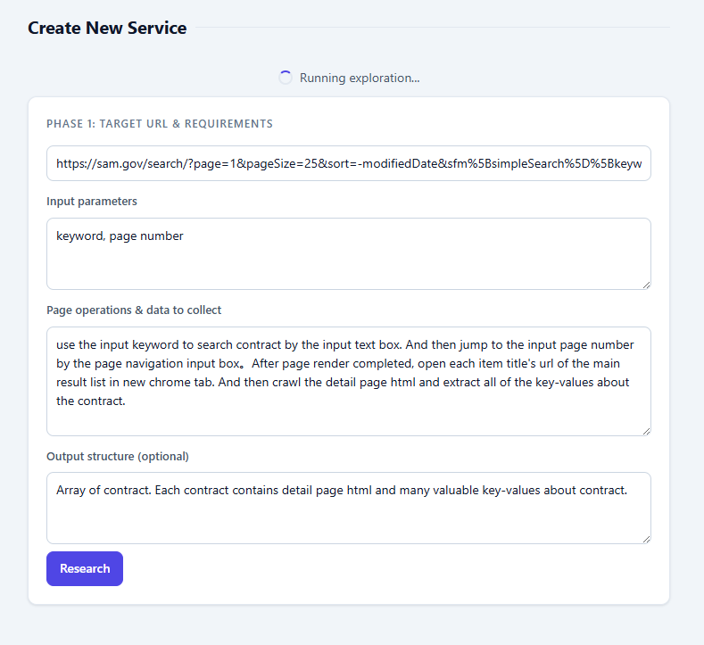
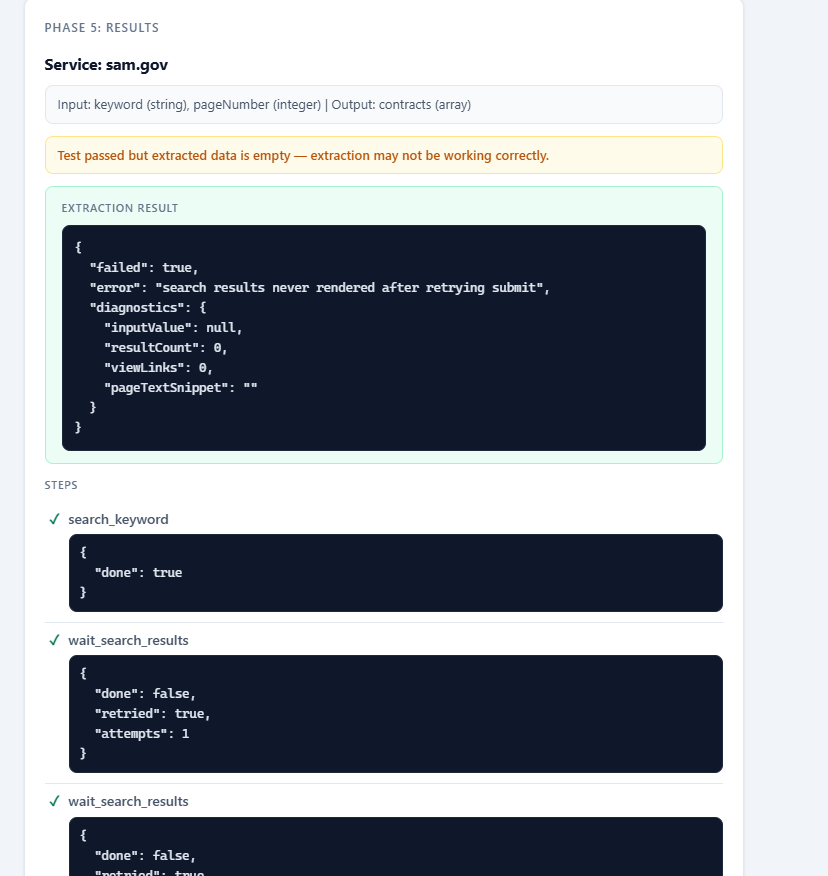

#  Scrapewright

**Describe the data you want in natural language; Scrapewright turns it into a reusable HTTP service.**

**English** | [简体中文](./README.zh-CN.md)

[](./LICENSE)


Open source · Self-hosted · Your data never leaves your machine

Extracting data from web pages traditionally means writing a scraper: learning a framework, hand-writing selectors, dealing with anti-bot measures, and redoing the work at every site redesign. **Scrapewright automates this process with AI**: in the wizard you describe the requirement in natural language; the AI opens the target page, analyzes its structure, generates the scraping script, and test-runs it on the spot. Once verified, it becomes a standard HTTP endpoint for programs, scripts, or AI agents to call.

It runs as a Chrome extension inside the **browser you already use**, which gives it three inherent advantages:

- **Login state reused as-is** — scrape sites you are already logged into, without cookie configuration or scripted logins
- **Full page fidelity** — anything visible in the browser is extractable: JS-rendered content, nested iframes, pagination, hover popups, and per-item detail pages
- **No automation fingerprint** — no headless-browser markers; requests come from a genuine browser

When a script fails, the AI analyzes the DOM snapshot and repairs it automatically; the same mechanism applies after a site redesign. Every service can also export a Markdown API doc for other AI agents to consume.

> **60-second start**
>
> 1. At `chrome://extensions/`, enable Developer mode → "Load unpacked" → select the project's `extension/` folder
> 2. `./bin/scrapewright install` to install the background service (`.\bin\scrapewright.cmd install` on Windows)
> 3. Extension icon → Options → Settings → configure your LLM → **+ New Service** → describe what you want → test → deploy
>
> Now any program can call it:
>
> ```bash
> curl -X POST http://localhost:8765/api/v1/services/my-service/execute \
>   -H "X-API-Key: dev-key" -H "Content-Type: application/json" \
>   -d '{"input": {"query": "hello"}}'
> ```

For internals, see the [Technical Whitepaper](docs/technical-whitepaper.en.md) (architecture, modules, customization guide).

## Table of Contents

- [Background](#background)
- [System Requirements](#system-requirements)
- [Quick Start](#quick-start) — [Installation](#installation) · [Create a Scraping Service](#create-a-scraping-service) · [Manage Services](#manage-services) · [Call a Service](#call-a-service)
- [scrapewright CLI Reference](#scrapewright-cli-reference)
- [Scraping Service Interface (HTTP API)](#scraping-service-interface-http-api)
- [Troubleshooting](#troubleshooting)
- [Core Features](#core-features) — [Why It's Valuable](#why-its-valuable) · [Comparison](#comparison) · [Typical Scenarios](#typical-scenarios)
- [Copyright & License](#copyright--license)

## Background

Traditional tools for extracting web data (Scrapy, Selenium, Puppeteer/Playwright, BeautifulSoup) share the same pain points:

| Pain point | What it looks like |
|------------|--------------------|
| **Expensive to build** | Hand-written selectors, pagination and anti-bot handling per site; every redesign restarts the maintenance clock |
| **Dynamic pages** | React/Vue SPAs, nested iframes, async-loaded content are out of reach for HTTP + HTML parsing |
| **Not reusable** | The spider you wrote for site A won't help with structurally similar site B |
| **No uniform interface** | Every job has its own I/O shape; orchestration goes nowhere |

Scrapewright's answer: **let AI configure the scrape inside a real browser, and standardize the result as an HTTP service.**

- **AI-driven** — describe the need in natural language; the LLM analyzes the page, writes the script, and self-repairs on failure
- **Real browser** — a Chrome extension running in your daily browser, reusing logins, cookies, and fingerprint as-is
- **Uniform interface** — JSON Schema on both input and output; the external shape never changes
- **Visual wizard** — a 5-phase flow from description to deployment; non-technical users can do it

## System Requirements

- Chrome browser (latest stable)
- Node.js >= 18
- An API key for any LLM: OpenAI / Moonshot Kimi / Anthropic / GLM (or any OpenAI-compatible endpoint)

## Quick Start

### Installation

#### 1. Load the Chrome Extension

1. Open Chrome and go to `chrome://extensions/`
2. Toggle on **Developer mode** (top-right)
3. Click **Load unpacked** and select the project's `extension/` directory

#### 2. Install the Host

The host is a lightweight Node.js service that exposes the HTTP API. One command registers it as an OS background service — auto-start at login, auto-restart on crash:

```bash
./bin/scrapewright install                    # Linux / macOS, default port 8765
.\bin\scrapewright.cmd install                # Windows (PowerShell)
./bin/scrapewright install --port=9123        # custom port (all platforms)
```

Then open the extension → **Options** → **Server Configuration**, confirm the port matches (default `8765`), and click **Test Connection**. A **Connected** badge means you're done.

#### 3. Configure the LLM

1. Extension icon → **Options** → **Settings** (top-right)
2. Under **LLM Configuration**, fill in:
   - **Provider / Model / API Key** — any of OpenAI, Moonshot / Kimi, Anthropic, GLM
   - **Base URL** (optional) — custom or OpenAI-compatible gateway; must include the path prefix (e.g. `https://api.openai.com/v1`)
   - **Max output tokens** (default 8192) — raise for reasoning models that burn "thinking" tokens and truncate output
   - **Timeout** (default 120s) — raise for slow models or very long prompts
3. Click **Save**

### Create a Scraping Service

On the Options page click **+ New Service** to enter the 5-phase AI wizard:

| Phase | What you do |
|-------|-------------|
| **1. Target & requirements** | Enter the target URL + a one-line requirement (which fields, pagination or not). Click **Research**; the AI opens the page, analyzes it, and drafts the service |
| **2. Name & steps** | Name the service; review/edit the AI-generated steps (each step is a script you can tweak) |
| **3. Interface definition** | Confirm input/output JSON Schemas and the test input |
| **4. Test run** | Watch the live step-by-step execution: open page → each step → success/failure |
| **5. Results** | Inspect the extracted data. Not happy? Hit **Auto-Fix** and let the AI repair it — or deploy |

<p align="center">
  
</p>
<p align="center">
  <em>Phase 1: describe the requirement in natural language; the AI analyzes the page and drafts the service</em>
</p>

During Research the AI works in rounds: explore the page structure, discover candidate selectors, confirm each one against real element HTML, then generate the step scripts — each round builds on the previous round's verified results. If the page needs a login or other human action, the wizard surfaces a banner with the matching button.

When a test fails, **Auto-Fix** kicks in: the AI gets the error, the DOM snapshot, and diagnostics data, rewrites the script, and retests; the best-scoring attempt across the loop is kept. In phase 5 you can also describe the problem in your own words (e.g. "publish date is missing") and the AI fixes accordingly. See [Whitepaper §5](docs/technical-whitepaper.en.md) for how it works.

<p align="center">
  
</p>
<p align="center">
  <em>Phase 5: inspect the extracted data; Auto-Fix repairs issues when needed</em>
</p>

### Manage Services

Everything lives on the Options page:

- **Enable / Disable** — toggle a service
- **Edit** — back to the wizard (pre-filled)
- **API Doc** — view / download the service's Markdown API documentation
- **Export / Import / Export All** — JSON import & export for moving between machines
- **Delete** — remove a service

The bottom of the page is **Execution History** (last 20 runs: time, service, success/failure).

### Call a Service

Once deployed, a service is a local HTTP endpoint. Three steps:

```bash
# 1. Submit a job (returns a jobId immediately)
JOB_ID=$(curl -s -X POST http://localhost:8765/api/v1/services/my-service/execute \
  -H "X-API-Key: dev-key" -H "Content-Type: application/json" \
  -d '{"input": {"query": "wireless mouse"}}' | jq -r '.jobId')

# 2. Wait for the result (blocks until done)
curl -s "http://localhost:8765/api/v1/jobs/$JOB_ID/wait?timeout=120" \
  -H "X-API-Key: dev-key" | jq '.job.result'
```

**Calling from AI agents.** Every service can export its Markdown API doc via the **API Doc** button on the Options page. Provide the document to agents such as Hermes Agent, WorkBuddy, or Lobster, and they can call the service directly.

Full interface details (parameters, states, error codes, page records): see [Scraping Service Interface (HTTP API)](#scraping-service-interface-http-api).

## scrapewright CLI Reference

`./bin/scrapewright` (Windows: `.\bin\scrapewright.cmd`, same commands):

| Command | Purpose |
|---------|---------|
| `install [--port=N]` | Install the host as an OS background service and start it |
| `status` | Service state + `/health` + port match |
| `doctor` | Full diagnostics (service, port, path drift, leftover artifacts) |
| `start` / `stop` / `restart` | Service control |
| `run [--port=N]` | Run in the foreground (debugging) |
| `logs [-f]` | Tail the host log |
| `throttle on / off / status` | Toggle Chrome anti-throttling launch flags (for [lazy-load sites](#lazy-load--infinite-scroll-sites-under-scrape)) |
| `uninstall` | Stop and remove the service |

## Scraping Service Interface (HTTP API)

All endpoints live under `http://localhost:{port}/api/v1` and require the `X-API-Key` header, except `/health`.

### Configuration

| Parameter | Default | Description |
|-----------|---------|-------------|
| `--port=N` / `SCRAPEWRIGHT_PORT` | `8765` | Listen port (CLI argument wins) |
| `SCRAPEWRIGHT_API_KEY` | `dev-key` | API key (change this in production) |

### Submit a job

```
POST /api/v1/services/{service-name}/execute
```

Body: `{ "input": { ... } }` (match the service's inputSchema)

Response (202):

```json
{ "success": true, "jobId": "xxxxxxxx-xxxx-…", "status": "queued", "queuePosition": 1 }
```

Concurrent requests queue automatically; `queuePosition` is your place in line (0 = executing).

### Get the result

```
GET /api/v1/jobs/{jobId}/wait?timeout=120   # blocks until done (timeout seconds, max 300)
GET /api/v1/jobs/{jobId}                    # returns current state immediately
```

Response once the job finishes (abridged):

```json
{
  "success": true,
  "job": {
    "id": "…", "status": "completed",
    "result": {
      "posts": [
        { "author": "…", "likes": "4", "sourcePageId": "page_0007_a1b2c3d4" }
      ]
    },
    "pages": [ { "id": "page_0007_a1b2c3d4", "url": "…", "title": "…", "html": "…" } ],
    "error": null
  }
}
```

- `result` — the structured data, shaped by the service's outputSchema
- `pages[]` — every page seen during the scrape (URL, title, cleaned HTML), for verifying where data came from
- `sourcePageId` — stamped on every extracted record, linking it to its source page

### Other endpoints

| Method | Path | Purpose |
|--------|------|---------|
| POST | `/api/v1/jobs/{jobId}/cancel` | Cancel a queued job |
| GET | `/api/v1/jobs` | List all jobs |
| GET | `/api/v1/services` | List all services (with I/O schemas) |
| POST | `/api/v1/services/{name}/steps` | Add a step to a service |
| PUT | `/api/v1/services/{name}/steps/{stepId}` | Update a step (script / flow fields) |
| DELETE | `/api/v1/services/{name}/steps/{stepId}` | Delete a step (chain auto-relinks) |
| GET | `/health` | Health check (no auth; for LB/K8s probes) |

### Job states and errors

| State | Meaning |
|-------|---------|
| `queued` / `running` | Waiting in queue / executing |
| `completed` | Success; result is in `result` |
| `failed` | Failed; reason is in `error` |
| `cancelled` | Cancelled |

| Error | Meaning |
|-------|---------|
| `ELEMENT_NOT_FOUND` / `SCRIPT_ERROR` | Element missing / script error — the AI attempts auto-repair |
| `SCRIPT_TIMEOUT` | Script timed out (default 60s) |
| `LOGIN_REQUIRED` | Target site needs login; log in and retry |
| `Extension timeout` | Host can't reach the extension — check it's loaded and ports match |

## Troubleshooting

Start by checking the **Host Status card** at the top of the Options page (red = host unreachable) and running `./bin/scrapewright doctor`.

### Host unreachable (Disconnected)

1. `./bin/scrapewright status` — is the service installed and running?
2. Does the port under **Server Configuration** on the Options page match the install (default `8765`)?
3. `./bin/scrapewright doctor` — full diagnostics; most problems come with the fix command.

### Service won't start

- **Node not found** — after upgrading/moving Node, re-run `./bin/scrapewright install` to rewrite the path
- **Port in use** — pick another with `./bin/scrapewright install --port=N` (update the extension side too)
- **Project directory moved** — re-run `install` from the new location; doctor detects path drift

### Read the host log

```bash
./bin/scrapewright logs -f                        # all platforms
tail -f ~/Library/Logs/scrapewright/host.log      # macOS
tail -f ~/.cache/scrapewright/host.log            # Linux
```

The full stack trace of a boot crash lands in `startup-error.log` next to `host.log`.

### Lazy-load / infinite-scroll sites under-scrape

Background tabs are throttled by Chrome, so `IntersectionObserver` lazy-loading (social feeds, infinite-scroll lists) may never trigger. Two measures:

```bash
./bin/scrapewright throttle on    # write anti-throttling flags into the Chrome launcher
# Quit Chrome completely, relaunch, then scrape normally
./bin/scrapewright throttle status  # verify; throttle off undoes it
```

Also enable **Enhanced Scraping Mode** under Options → Settings (dispatches real wheel events when scrolling stalls). How the five-layer anti-throttle stack works: [Whitepaper §9](docs/technical-whitepaper.en.md).

### Code changes not taking effect

- Extension code → reload at `chrome://extensions/` (refresh icon on the card)
- Host code → `./bin/scrapewright restart`

## Core Features

### Why It's Valuable

- **Configure once, reuse forever** — the scrape logic becomes a service, not a script you rewrite each time; schemas on both ends mean callers never care what the target site looks like
- **Zero-cost login state** — reuses your logged-in browser session; the hardest thing for server-side tools to replicate
- **Self-healing** — auto-fix analyzes failures and rewrites scripts at config time and at runtime; after a redesign, repair beats rewrite
- **Data stays local** — self-hosted; the LLM only sees page structure at configuration time (never needed at run time)
- **Non-technical friendly** — wizard-driven with visual element annotation; annotate your intent and the AI generates from it
- **More than scraping** — the same step-graph engine works as lightweight web test automation (click, type, wait, assert, branch)
- **Scalable** — multi-instance parallel deployment (Docker/K8s) when you need more throughput (see [Whitepaper §12](docs/technical-whitepaper.en.md))

Under the hood: cross-iframe scraping, per-item detail-page drill-down (`$openTab`), hovercard field enrichment (`$extractWithHover`), streaming-content completion detection (`$waitForStable`), obfuscation-resistant stable selectors, and prompt-size guards. The script DSL has 19 primitives — all AI-generated and hand-editable; see [Whitepaper §7](docs/technical-whitepaper.en.md).

### Comparison

AI-assisted scraping has four technical lanes. The core question is **whose browser**:

| Lane | Representatives | Browser | Login state |
|------|-----------------|---------|-------------|
| Server-side headless | Firecrawl, Crawl4AI | Chromium on a server | Cookie injection required |
| Server-side AI agent | Skyvern, Browser-use | Browser on a server | Scripted login |
| Developer coding-style | Claude Code + Playwright | Local/CI headless | Manual handling |
| **Client-side extension (this project)** | **Scrapewright** | **Your daily Chrome** | **Natively reused** |

Differences vs sibling products:

| Product | Core difference |
|---------|-----------------|
| [Firecrawl](https://www.firecrawl.dev/) | We reuse your login state + generate executable scripts (not just HTML→Markdown); deployed locally |
| [Crawl4AI](https://github.com/unclecode/crawl4ai) | We're a visual wizard (no Python required) |
| [Skyvern](https://www.skyvern.com/) / [Browser-use](https://browser-use.com/) | We configure once into a repeatable service (vs interactive driving every time) |
| [AgentQL](https://agentql.com/) | We provide full multi-step orchestration + auto-fix (vs single-point selector intelligence) |

**Well suited to:** login-required scraping (intranets / paid content / SaaS dashboards), non-technical users customizing scrapes, low-frequency high-value queries (AI answers, people/org lookups, knowledge graphs), complex pages (iframes, dynamic loading, streaming output).

**Not suited to:** 10k+ URL high-concurrency scraping (single-browser bottleneck — use server-side tools), 24×7 unattended operation (depends on the local Chrome running), network-layer intercept / mock (use Playwright / CDP).

**One-line positioning: an AI scraping assistant inside your (or your team's) browser — it turns "open browser → log in → operate → extract" into an HTTP service that programs can call.**

### Typical Scenarios

- **Internal reporting automation** — logged-in admin panels and dashboards; pull key metrics on schedule
- **AI answer collection** — send identical prompts to multiple AI chatbots, gather answers for evals or knowledge bases
- **List + detail pages** — search results / product lists with per-item detail drill-down for complete fields
- **Portal / government sites** — announcements buried in nested iframes
- **Intelligence & knowledge graphs** — low-frequency high-value lookups on people, orgs, topics
- **Web test automation** — step graphs as "click → type → assert" regression tests

## Copyright & License

This project is open-sourced under [**GPLv3**](./LICENSE).

- Free to use, modify, and distribute, including commercially
- Distribution or SaaS-style deployment **must** open-source your derivative code under the same GPLv3 terms
- Preserve the original copyright and license notices

Full legal text in [`LICENSE`](./LICENSE). Bug reports and PRs are welcome (submitting means agreeing to release under GPLv3).

```text
Scrapewright
Copyright (C) 2026 Scrapewright Contributors

This program is free software: you can redistribute it and/or modify
it under the terms of the GNU General Public License as published by
the Free Software Foundation, either version 3 of the License, or
(at your option) any later version.

This program is distributed in the hope that it will be useful,
but WITHOUT ANY WARRANTY; without even the implied warranty of
MERCHANTABILITY or FITNESS FOR A PARTICULAR PURPOSE.  See the
GNU General Public License for more details.
```
